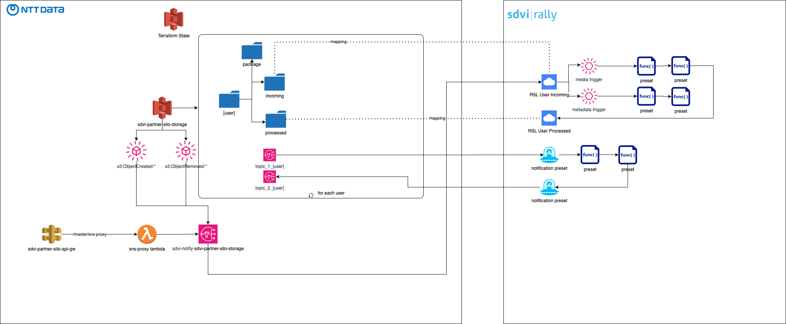

# Chapter-0: General Architecture

## What is SDVi Rally?

"SDVI Rally" is a media supply chain management platform.

It is a cloud-based platform that allows users to manage their media supply chain workflows.

**Purpose:**
- SDVI Rally is designed to help media companies modernize and optimize their content supply chains.
- It aims to streamline the processes of receiving, processing, and delivering media content.

**Key Features:**
- _Automation_: It automates various aspects of the media supply chain, including content receipt, validation, and processing. 
- _Cloud-Based_: It leverages cloud resources to provide scalability and flexibility.
- _Resource Optimization_: It dynamically allocates resources based on demand, helping to reduce costs and improve efficiency. 
- _Supply Chain Optimization_: It allows users to build supply chains based on various parameters, such as technical, operational, and financial requirements. 
- _Rally Connect_: This is a content exchange service that simplifies and accelerates the process of receiving and delivering content and metadata between business partners. 

**Benefits:**
- Increased business agility. 
- Improved operational efficiency. 
- Enhanced process intelligence. 

SeeAlso: 
[Introduction-to-SDVI-Rally](https://sdvi.my.site.com/support/s/article/Introduction-to-SDVI-Rally)

## SDVI Partner Silo

NTT Data AWS account simulates the customer environment.
It consists of very few elements:
- an S3 bucket acting as terraform backend to store the state file
- an S3 bucket to store the media files, incoming and processed 
Each user has its own root folder in the bucket, with 3 child folders:
  - {username}/incoming, for incoming files. Bound to this folder S3 notifications are sent to the Rally RSL for every object creation and deletion.
  - {username}/processed, for processed files
  - {username}/package, for package files to be referred by preset as Eval2Package config field

Bucket notification are sent to Rally using a per bucket SNS topic, `sdvi-notify-sdvi-partner-silo-storage`. routing happens in Rally RSL configuration using prefix.

Two SNS topics are created for each user, to send or receive notifications to and from Rally notification preset:
  - {username}_topic_1
  - {username}_topic_2

It's possible to trigger the publication of a message to the SNS topic by creating a notification preset or invoking the https://g7j1jsfupb.execute-api.eu-west-1.amazonaws.com/master/sns-proxy API.
It accept a POST request with these two request parameters:
  - `topic`: the topic numbere to trigger (1 or 2)
  - `username`: the username as it appears in the bucket path

body of the request is the json message to send to the topic.

Authentication is by api key : `SaqpTEgFlx2u0YFkWRnMj6zGircfmn0x4p7jwgp1`

