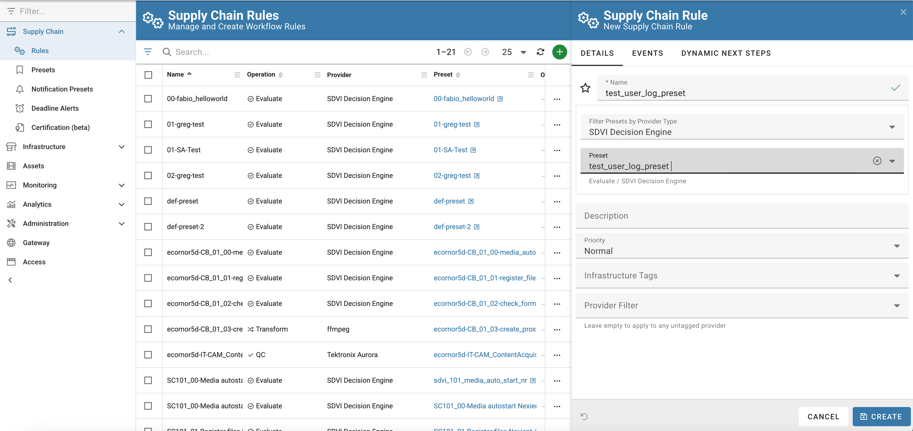

# Chapter-2: First preset

## Rally SDK
Head to [Rally SDK](https://sdvi.my.site.com/support/s/article/Rally-Python-SDK-Why-Do-I-Need-This-And-How-To-Use-It) to understand what the Rally SDK is.

## Create a (very basic) preset to validate our setup
We will create a very basic preset to validate our setup. Something that will just log the input.

Select the `Presets` menu on the left hand menu.


and click on `Create`.


fill the form with as in the the following screenshot, and click on `Create`.
Name the preset as you wish, but remember it, as we will use it in the next steps and **set SDVI Decision Engine as the provider type**.

<span style="text-decoration:underline">**N.B. Keep a consistent naming convention, always prefix your username across all resources you're going to create, this will help the management and cleanup of the silo**</span>


Then open the preset editor by clicking on the corrsponding `Open Preset Editor` button.


Fill the editor with the following code:
```python
import json

def eval_main(context):
  print('Start log preset')
  data = context.get('dynamicPresetData')
  message = json.dumps(data) if isinstance(data, dict) else repr(data)
  print("data:" + message)  
  return True
```


Then save the preset by clicking on the `Save` button.

Create the rule to activate the preset.

Activate the `Rule` menu item on the left, and click on the green `+` button.
Then fill the for with the proper values, and click on `Create`.

IAM Role is the same already used for the RSLs (`arn:aws:iam::117342603894:role/sdvi-partner-silo-dev-role`)

Topic ARN follow the pattern `arn:aws:sns:eu-west-1:117342603894:sdvi-partner-silo-topic-1-{username}`



From the left hand menu select the `Notification Presets` menu item and select `create` after ellipsis expansion on the upper right corner.

Other documentation on crating rules and presets can be found [here](https://sdvi.my.site.com/support/s/article/Introduction-to-Rules-and-Presets)


Fill the form with the proper values and click on `Save`:


You can create a notification preset via API. Documentation [here](https://partner.sdvi.com/apidocs/index.html#resource-reference-notification-presets-post-notificationpresets)
POST /notificationPresets
```json
{
    "data": {
        "attributes": {
            "address": "arn:aws:sns:eu-west-1:117342603894:sdvi-partner-silo-topic-1-test_user",
            "awsRole": "arn:aws:iam::117342603894:role/sdvi-partner-silo-dev-role",
            "name": "test_user_topic_1_trigger",
            "paused": null,
            "replyTo": null,
            "type": "SNS Recv"
        },
        "type": "notificationPresets"
    }
}
```


## Test it
The preset is now ready to be tested.
We're going to use the API to send a message to the SNS topic.

<pre>
curl -X POST https://g7j1jsfupb.execute-api.eu-west-1.amazonaws.com/master/sns-proxy \
-H "Content-Type: application/json" \
-H "x-api-key: SaqpTEgFlx2u0YFkWRnMj6zGircfmn0x4p7jwgp1" \
-d '{
   "message":"{\"msg\":\"hello\"}",
   "topic":1,
   "username":"test_user"
}'</pre>

To check the result, activate the `Jobs` menu item on the left hand menu under the `Monitoring` section, and filter results by preset name.

Preset is executed anonymously, so you won't see any asset on the `Run on Asset` column.

Clicking on the status icon will show the details of the execution.

