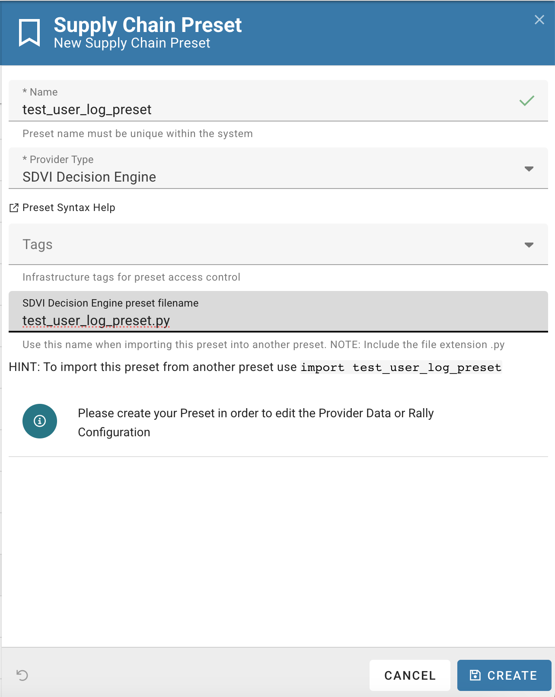

# Chapter-2: First preset

## Rally SDK
Head to [Rally SDK](https://sdvi.my.site.com/support/s/article/Rally-Python-SDK-Why-Do-I-Need-This-And-How-To-Use-It) to understand what the Rally SDK is.

## Create a (very basic) preset to validate our setup
We will create a very basic preset to validate our setup. Something that will just log the input.

Select the `Presets` menu on the left hand menu.

and click on `Create`.

fill the form with as in the the following screenshot, and click on `Create`.
Name the preset as you wish, but remember it, as we will use it in the next steps and **set SDVI Decision Engine as the provider type**. 
