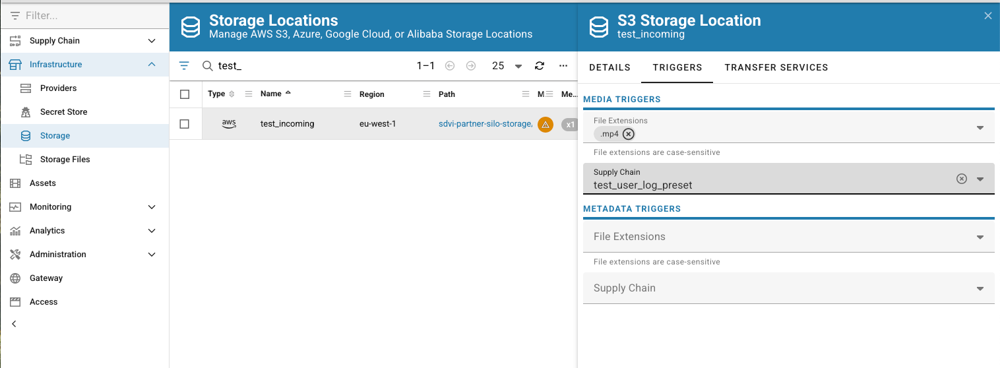
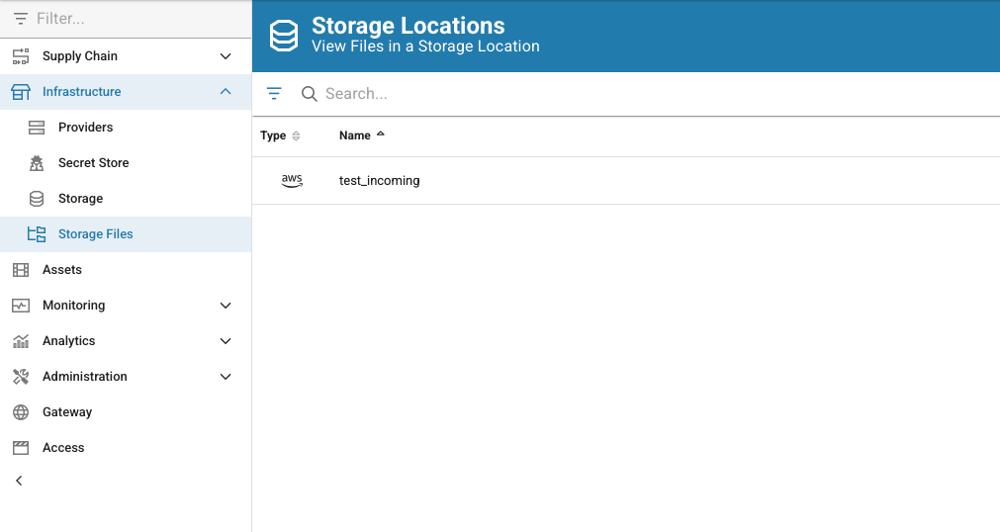
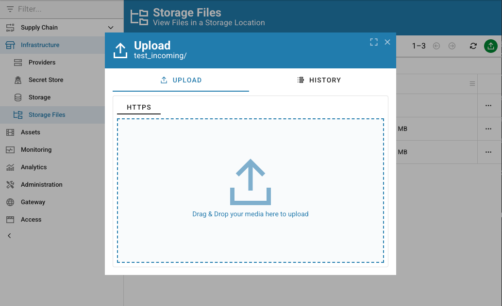

# Chapter-3: RSL setup validation

In a similar way we can validate the RSL setup.

Select the `Storage` menu on the left hand menu and activate the `Triggers` tab

_Media triggers_ are the way Rally is notified of media changes in the S3 bucket,
while _Notification triggers_ are the way it is notified of metadata changes in the RSL.

Media and metadata are usually delivered as different files in the same S3 bucket, so it is important to have both triggers set up and a way to discriminate between the two.

Nothing prevents you from handling such events with the same preset.

For our purpose we are simply connecting the media trigger to the preset we created in the previous chapter.

Once done we can just upload a file in the incoming folder of the bucket and check the logs in the preset.

Select the `Storage Files` menu on the left hand menu and click on the configured RSL.

You will see the list of files in the RSL, and you can upload a file in the incoming folder.

Then you can check the logs in the preset from the `Monitoring` section as explained in the previous chapter.