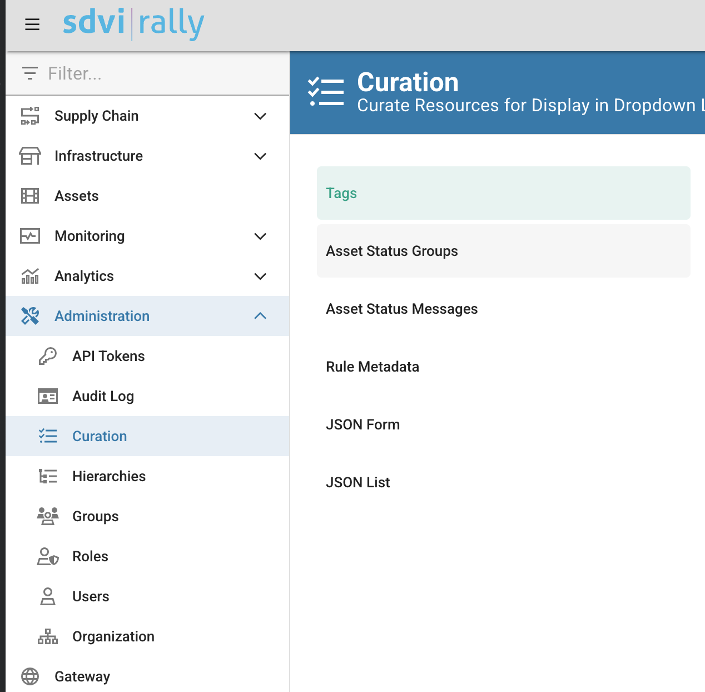

# Chapter-4: How To Create Your First Supply Chain

Follow [How To Create Your First Supply Chain](https://sdvi.my.site.com/support/s/article/Use-Case-How-To-Create-Your-First-Supply-Chain-Media-Centric-1-of-2-Decision-Engine) to create you first supply chain.

Some concepts should already be familiar to you, like the `Preset` and the `Rule`.

## Additional steps
### Step 1: Create an asset tag
Within the 'Register Files' step add an invocation to the `add_asset_tags` sdk method.
[Here](https://partner.sdvi.com/docs/evaluate/api.html#rally.asset.add_asset_tags) is the official api documentation

You can use the tag automatically provisioned with your account creation.

*Hint*: Tags are visible from the Administration -> Curation menu.
