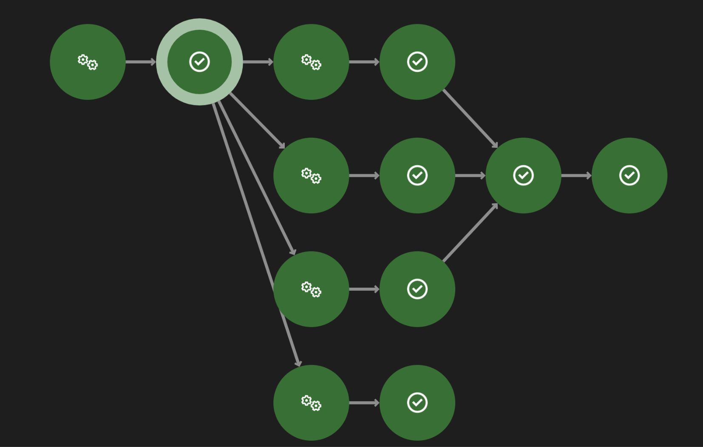

# Chapter-7: Dispatch Next Steps (Split Or Sequencing)

In Rally, you can dispatch a job to multiple steps in a sequence or split the job into multiple steps. 
This chapter will guide you through the process of dispatching a job to multiple steps in a sequence or splitting the job into multiple steps.  

## Dispatching a job to multiple steps in a sequence
In some scenarios, you may run a preset that identifies some dynamic_preset_data that you want to use by a "provider" (other than eval), and may want to preserve that data for the following step.  

## Dispatching a job to parallel steps in a split
In some cases, you may be able to optimize your supply chain by parallelizing tasks that don't have any dependence with each other.  

The official documentation is available [here](https://sdvi.my.site.com/support/s/article/Decision-Engine-Dispatch-Next-Steps-Split-Or-Sequencing).  

The diagram below shows the corresponding representation of the parallel steps example provided in the documentation, within the **SDVI Rally Visualizer**, a tool used to graphically display workflow logic, execution paths, and decision branches as configured in the Rally platform. The purpose of including this visualization is to facilitate the understanding of a supply chain that includes parallel processing steps, making it easier to comprehend how the Decision Engine manages concurrent workflows. 

For comprehensive information about the Rally Visualizer and its capabilities, refer to the documentation [here](https://sdvi.my.site.com/support/s/article/Rally-Visualizer).  

