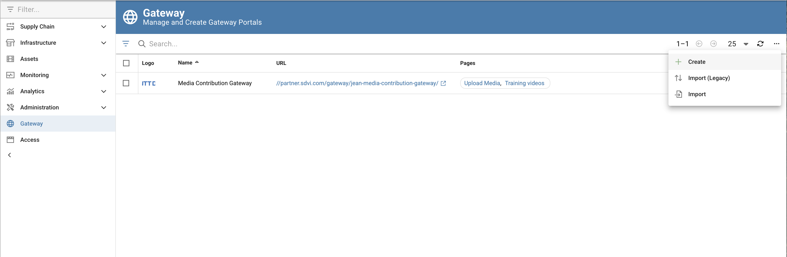
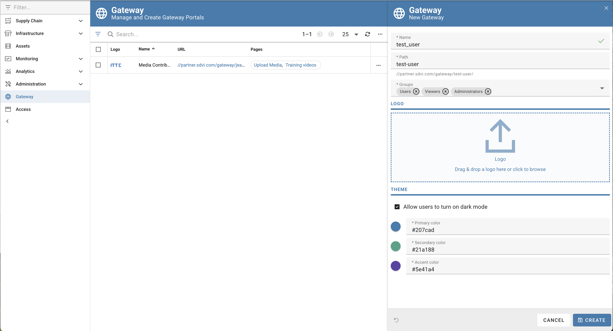
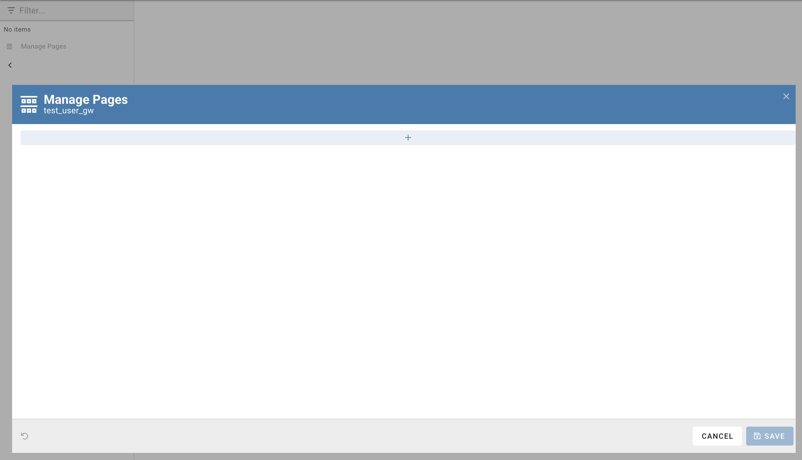
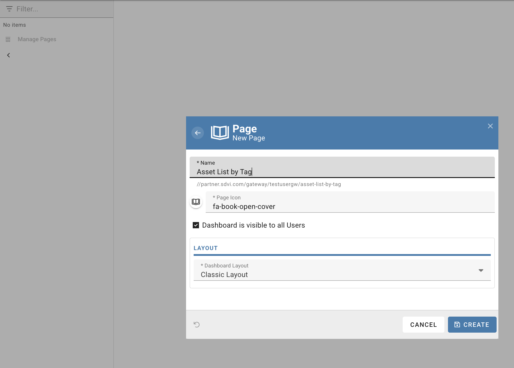

# Chapter-10: Rally Gateway portals

The Rally Gateway widget framework enables supply chain managers to quickly build or modify custom interfaces for operators or third-party partners without modifying any underlying code.

Rally Gateways are organized in portals, each portal can have multiple widgets. Each widget can be configured to display a specific set of information or perform a specific action. 

## Create your portal

To create a new portal, navigate to the `Gateways` section of the Rally UI and click on the `Create Portal` button.

Fill form data and click on the `Create` button.

**Note**: usernames contain '_' character that is not allowed as a part of the path `field`, feel free to change it to '-' or simply remove it.

## Create your portal page
To create your first portal page, enter the portal by clicking the gateway portal URL and select the `Manage Pages` grayed menu item on the left side of the page.

Click on the `+` button and fill the form data.

## Add a widget to your portal
Follow this [guide](https://sdvi.my.site.com/support/s/article/Gateway-Widget-Asset-List) to add a widget to your portal.
Filter the `Asset List` by tag as per step 1 of chapter 4.

Pay attention to the sorting and filtering options, they are very useful to quickly find the asset you are looking for.

But remember that the `Asset List` widget is not a search engine, it's a list of assets that match the filter criteria.

In particular there's no way to sort a list by a user defined field, the choice is fixed to the fields available in the widget selector.