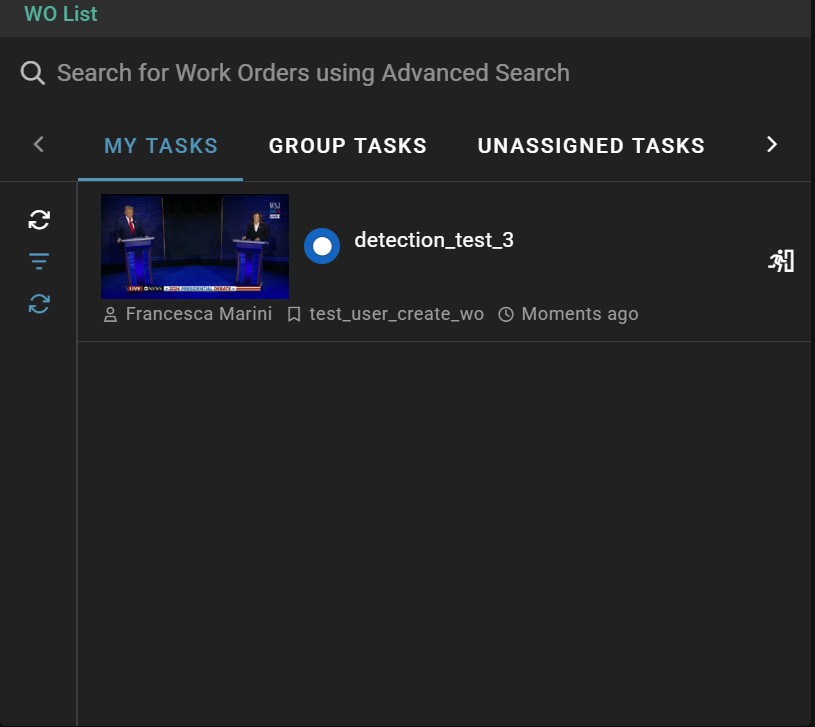

# Chapter-11: Rally Gateway workorder
We are going to create a workorder to be used in the Rally Gateway with a custom form.

## Create work order from preset
Create a new preset selecting the `Rally Gateway Work Order` provider type as in the following screenshot


Open the preset editor and fill the form with the following (referenced also [here as JSON file](workorder.json)):

```json
{
  "gateway": {
    "markdown": {
      "TechMarkdown": [
        "{{ DYNAMIC_PRESET_DATA['message'] }}"
      ]
    },
    "schemas": {
      "techValidation": {
        "displayRules": [
          {
            "type": "markdown",
            "value": "### Failure reason(s)\n{{ DYNAMIC_PRESET_DATA['message'] }}"
          },
          {
            "enum": [
              "Reject File",
              "Ingest anyway",
              "Send to Leeds"
            ],
            "presentation": {
              "type": "radio"
            },
            "schemaProperty": "NextAction"
          },
          {
            "schemaProperty": "Comments"
          }
        ],
        "schema": {
          "$id": "md-1",
          "properties": {
            "Allow Existing Asset for Critical Delivery": {
              "default": false,
              "title": "Allow Existing Asset for Critical Delivery",
              "type": "boolean"
            },
            "Comments": {
              "title": "Comments",
              "type": [
                "string"
              ]
            },
            "NextAction": {
              "title": "Next action",
              "type": [
                "string"
              ]
            }
          },
          "required": [
            "NextAction"
          ],
          "title": "Tech Validation",
          "type": "object"
        }
      }
    }
  }
}
```
[Here](https://sdvi.my.site.com/support/s/article/Metadata-Form-Use-in-Rally-and-Gateway) article on custom forms. 
To save the workorder output in metadata you should add:
```json
{
  "PresetName": "tech_validation__workorder",
  "enableMio": true,
  "outputSpec": {
    "techValidation": {
      "label": "{{ DYNAMIC_PRESET_DATA['label'] }}",  
      "location": "{{ DYNAMIC_PRESET_DATA['location'] }}",
      "name": "{{ DYNAMIC_PRESET_DATA['name'] }}"
    }
  }
}
```

## Create your work order page
Enter the gateway page created in chapter 10 and create a new portal page.


### Workorder widget
Add a work order widget to the page selecting the `Work Order` -the last one- option from the available widgets list


Fill the form with:
* Name
* Work Order Provider
* Presets
* Allowed Actions
and click the `Create` button


### Metadata Edit widget
The Metadata Widget works in two modes:
* **Session Mode**: A static form predefined in the widget, only for a single gateway page.
* **Work Order Mode**: This type of metadata form is dynamically loaded based on the selected workorder, and allows to complete a task directly from the form.

#### Session Mode
The “Session” mode allows a Gateway widget designer to create metadata forms on a per-page basis in a given Gateway Portal. The Session mode Metadata widget is generally used in conjunction with other widgets, such as Asset Picker and Supply Chain Trigger widgets, allowing a user to submit user defined data and/or metadata back to Rally core.

[More on this topic](https://sdvi.my.site.com/support/s/article/Gateway-Widget-Metadata-Edit-Session-Mode)
#### Work Order Mode
The “Work Order” mode allows a Gateway widget designer to display desired metadata fields and inputs as defined in a Rally Gateway Work Order preset.

[More on this topic](https://sdvi.my.site.com/support/s/article/Gateway-Widget-Metadata-Edit-Work-Order-Mode)

Add a metadata edit widget to the page selecting the `Metadata Edit` option from the available widgets list


Note:
* select `Work Order Mode` as **Metadata Schema**
* set `techValidation` as **Schema Name**

Your page should look like this:


## Create a work order
After you crate your preset and your gateway page, you can create a work order.
You need to run the preset on the asset. it can be used the `Advanced Runner`, more information on how to use it in [This Article](https://sdvi.my.site.com/support/s/article/How-To-Manually-Run-Presets-and-Rules-From-The-Rally-UI). You can pass the dynamic fields (DYNAMIC_PRESET_DATA) in dynamic preset data as a dict. In this case for i.e.:
```json
{
    "message": "This is a test message",
    "label": "test_label",
    "location": "test_processed",
    "name": "test_name"
}
```
where:
* `message`: This is the message that will be displayed in the workorder.
* `label`: This is the label that will be saved in the asset inventory.
* `location`: This specifies the RSL (Resource Storage Location) where the output file will be stored.
* `name`: This is the name of the output file, which will be saved as a JSON file in this case.

You can create a preset to add the dynamic preset data (DPD) before running the workorder preset, and then call the workorder preset from it.

## In the gateway page
Go to `Unassigned tasks` in WO List

Then select `Take and Activate` button (walking man on the right).
Once you take and activate the workorder, it will be moved in `My Tasks` section.

After that you can select the asset. After selecting the asset, you can see the custom form.

And you can choose the action to perform (for i.e. select `Ingest anyway`). To close the workorder click on `Complete Workorder`.

## Storing results
After this action, if you decide to store the ouput you can see the result in the asset inventory.

And the file would be something like
[this](./images/wo_result_file_structure.png)
