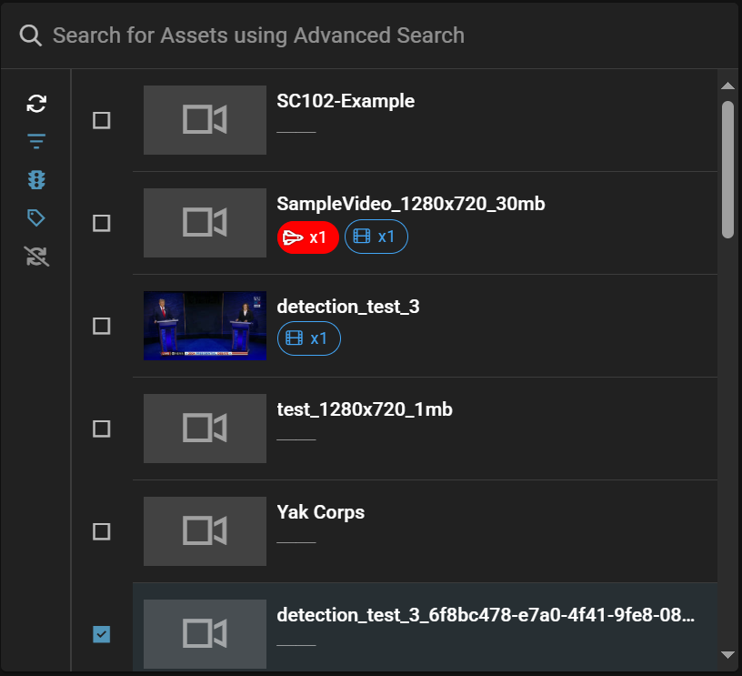
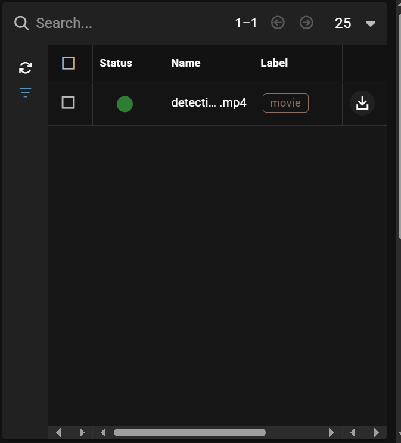
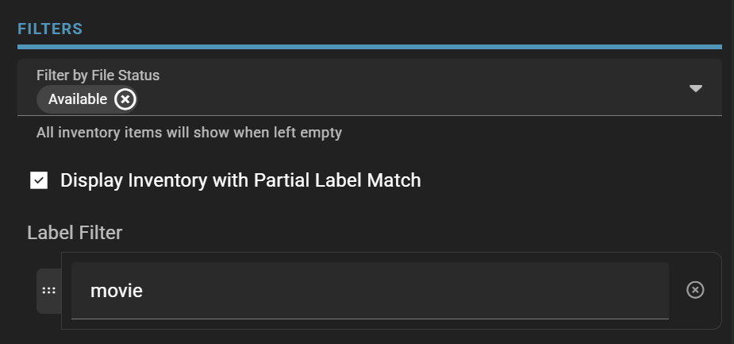
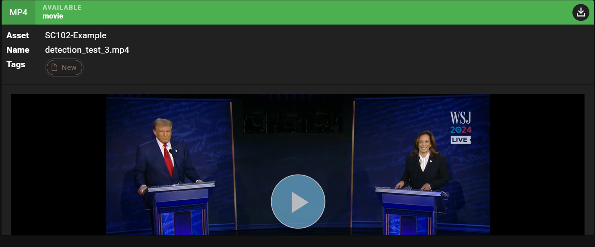

# Gateway for a file preview

As first widget you need to add an `Asset Picker`.

More information about this widget [here](https://sdvi.my.site.com/support/s/article/Gateway-Widget-Asset-Picker).

Then add a `Asset Inventory` widget.
Once an asset has been selected, the `Asset Inventory` widget will display the inventory of the asset.

In this example the label is used to filter juste the available movie files.

More information about this widget [here](https://sdvi.my.site.com/support/s/article/Gateway-Widget-Asset-Inventory).

The last widget is the `Preview` widget.

More information about this widget [here](https://sdvi.my.site.com/support/s/article/Gateway-Widget-Preview).

[Here](https://partner.sdvi.com/gateway/testusergw/preview-file) the used example.