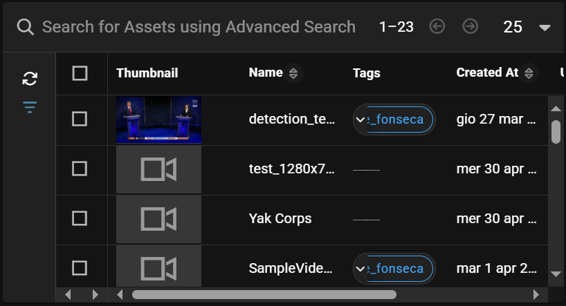
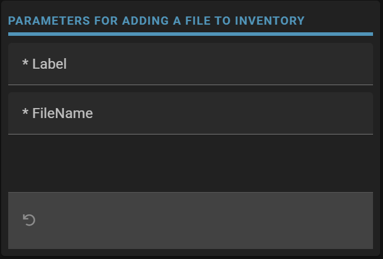
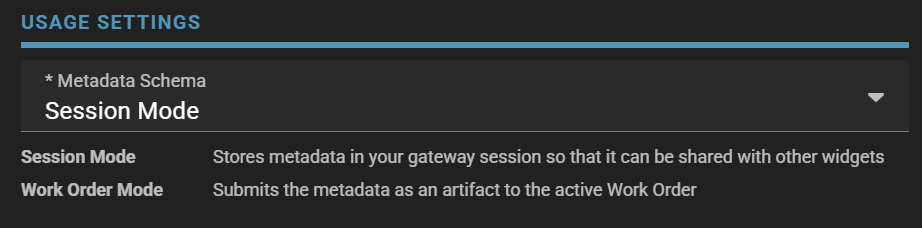
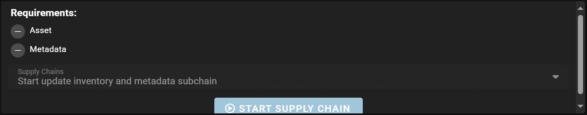

# Starting Workflows

## Manually with UI
[Official Documentation here](https://sdvi.my.site.com/support/s/article/How-To-Manually-Run-Presets-and-Rules-From-The-Rally-UI)

## From a Workorder 
As first widget you need to add an `Asset List`.



to pick the asset you want to start the workflow on.
More about Asset List widget [here](https://sdvi.my.site.com/support/s/article/Gateway-Widget-Asset-List).

Then add a `Metadata Edit` widget.



In this case this widget is used to pass some information through the `dynamic_preset_data`.
for i.e.
```json
{
  "displayRules": [
    {
      "schemaProperty": "Label"
    },
    {
      "schemaProperty": "fileName"
    }
  ],
  "required": [
    "fileName",
    "Label"
  ],
  "schema": {
    "$id": "md-1",
    "properties": {
      "Label": {
        "default": "",
        "minLength": 1,
        "title": "Label",
        "type": [
          "string"
        ]
      },
      "fileName": {
        "default": "",
        "minLength": 1,
        "title": "FileName",
        "type": [
          "string"
        ]
      }
    },
    "title": "Parameters for adding a file to inventory",
    "type": "object"
  }
}
```
[Here](https://sdvi.my.site.com/support/s/article/Metadata-Form-Use-in-Rally-and-Gateway) article on custom forms.

*Note*: This widget is a `Session Mode` one.



More about this Widget in `Session Mode` [here](https://sdvi.my.site.com/support/s/article/Gateway-Widget-Metadata-Edit-Session-Mode).

Then add a `Supply Chain Trigger` widget.



More about this widget [here](https://sdvi.my.site.com/support/s/article/Gateway-Widget-Supply-Chain-Trigger)

This example demonstrates starting a supply chain on an existing asset, adding a file to the inventory, and creating an inventory entry in the user metadata.
[Example here](https://partner.sdvi.com/gateway/testusergw/start-workflow)


## 3rd Parties To Trigger SDVI Workflows
[Official Documentation here](https://sdvi.my.site.com/support/s/article/How-To-Allow-3rd-Parties-To-Trigger-SDVI-Workflows)

*Note*: In the 1st step:
* _workflowServiceUrl = 'https://demo.sdvi.com/api/v2/workflows' Should be replaced whith the URL of https://partner.sdvi.com/
* _token = '' Personal token. [here](https://sdvi.my.site.com/support/s/article/Rally-v2-API) how to create it. 
* _supplyChain = 'EVTZ-API Update' is the name of the preset you want to trigger.
* _asset = '' is the asset you want to start the supplychain on.

*Note*: 2nd step using `Decision Engine`
```python
from rally import files, supplyChain
import json
def eval_main(context):
  dynamic_preset_data = context.get("dynamicPresetData", {})
  if dynamic_preset_data.get('messageType') == 'workflowApiPost':
    # Extract the data from the API payload
    api_initial_data = json.loads(files.read_file(dynamic_preset_data["fileUri"]))
    print(api_initial_data)
    if api_initial_data:
       # Add the processing of the message here
       asset_name = api_initial_data.get('asset')
       if asset_name:
            supplyChain.start_new_supply_chain(asset_name, "resume", dynamic_preset_data={})
    else:
        print('Message not well formed')
        return ''
```
