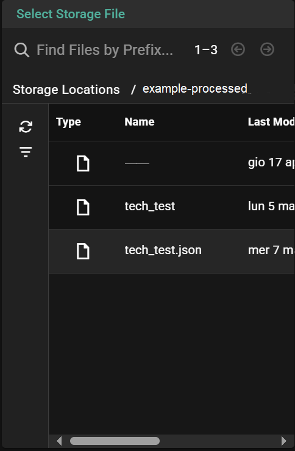
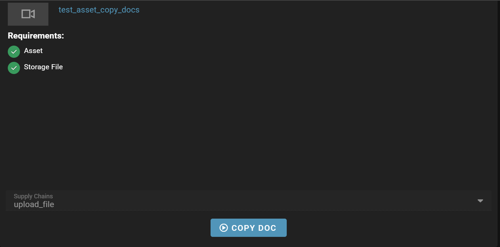

# Copy docs workorder

## Asset 
Create a new asset with a future file in inventory:


This file has `test_incoming` as location.


## Gateway

As first widget you will need to add an ` Storage File Picker`.



More about this widget [here](https://sdvi.my.site.com/support/s/article/Gateway-Widget-Storage-File-Picker).

From a different location select an existing file.

Then add a `Asset Picker` widget.


More information about this widget [here](https://sdvi.my.site.com/support/s/article/Gateway-Widget-Asset-Picker).

Select the asset created before.

Then add a `Asset Inventory` widget.


More information about this widget [here](https://sdvi.my.site.com/support/s/article/Gateway-Widget-Asset-Inventory).

In this case the filter is set to `Future` as status.


Select the file in the asset.

Then the supply chain should be started with the `Supply Chain Trigger` widget.



More information about this widget [here](https://sdvi.my.site.com/support/s/article/Gateway-Widget-Supply-Chain-Trigger).

# Presets

The first preset in the supply chain is a step to handle the widget information.

```python
import os
from rally import files, supplyChain
import json


def eval_main(context):
    storage_file_picker_filter = retrieve_selected_panel_data(context, "Select Storage File"
    )
    asset_inventory_filter = retrieve_selected_panel_data(context, "Inventory")
    uri = storage_file_picker_filter["uri"]
    label = asset_inventory_filter["label"]
    storage_file_name = os.path.basename(uri)

    print(f"Selected file URI: {uri}")
    print(f"Selected inventory label: {label}")

    if not storage_file_name:
        # TODO: handle with operator notification?
        return

    new_file_name = asset_inventory_filter["new_file_name"]

    files.remove_inventory(next(files.get_inventory(label)), mode="forget")
    files.add_inventory(uri, label, auto_analyze=False)

    _, extension = get_file_name_and_extension(storage_file_name)

    return supplyChain.SupplyChainStep("mover", {"new_file_name": new_file_name, "label": label})


def unescape_and_parse_json_file(uri: str) -> dict:
    """Attempt to parse the input file as JSON content from the given URI into a Python object.
    Raises an exception if the content cannot be parsed as JSON."""
    try:
        file_content = files.read_file(uri).decode()
        metadata = json.loads(file_content)

    except Exception as err:
        raise Exception(f"Cannot parse metadata file: {uri}") from err

    return metadata

def get_file_name_and_extension(file_name):
    """Returns the file name and extension as a tuple."""
    name, extension = os.path.splitext(file_name)
    return name, extension[1:].lower()


def retrieve_selected_panel_data(context: dict, widget_name: str):
        """Retrieves the selected panel data from the context."""
        widget_metadata = {}
        data = context.get("dynamicPresetData")
        file_uri = data["fileUri"]
        print(f"Loading json file: {file_uri}")
        notification = unescape_and_parse_json_file(file_uri)
        print(f"{notification}")

        try:
            notification_data = notification.get("data", {})

            if notification_data:
                widget = next(
                    filter(
                        lambda widgetdata: widgetdata.get("name") == widget_name,
                        notification_data,
                    ),
                    None,
                )
                if widget:
                    if widget_name == "Select Storage File":
                        widget_metadata["uri"] = widget["data"][0]["storageFile"][
                            "attributes"
                        ]["uri"]
                    elif widget_name == "Metadata Edit":
                        widget_metadata = widget["data"][0]["metadata"]

                    elif widget_name == "Placeholder CD Number":
                        widget_metadata = widget["data"][0]["metadata"]

                    elif widget_name == "Inventory":
                        widget_metadata["label"] = widget["data"][0]["file"][
                            "attributes"
                        ]["label"]
                        widget_metadata["new_file_name"] = widget["data"][0][
                            "file"
                        ]["attributes"]["name"]
                        print(widget)

                    return widget_metadata
            return None

        except Exception as e:
            print(f"No panel data found on gateway panel {data}: {e}")
            return None
```

After this step in the asset inventory we should have the file with the name and the storage of the original file selected in the `Storage File Picker` widget.

The second preset should be a `Mover` preset to copy the file from the original bucket to `test_inbount`. 
More about Mover [here](https://partner.sdvi.com/docs/preset/sdviMoverHelp.html)
*Note*: Mover Provider doesn't work on partner silo. It should be something like:
```json
{"tasks":
  {
    "source": {
      "optional": false,
      "inventory": {
        "labels": ["{{ DYNAMIC_PRESET_DATA['label'] }}"],
        "storageSet": ["example-processed"]
      }
    },
    "destination": {
      "name": "{{ DYNAMIC_PRESET_DATA['new_file_name'] }}",
      "overwrite": "always",
      "inventory": {
        "storage": "test_inbount"
      }
    },
    "operation": "copy"
  }
}
```
After this step the file in the inventory should be overwritten with the file name and location we've set up at asset creation. 